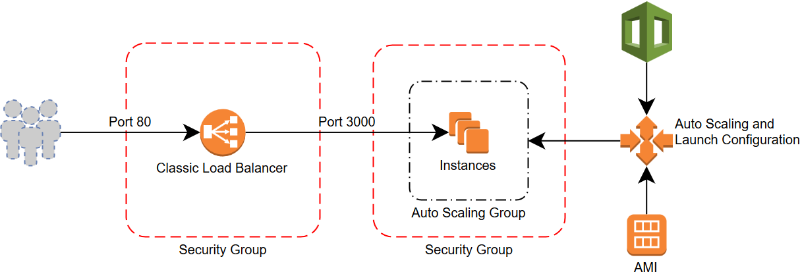

# node-app

This repository demonstrates the pipeline to deploy a simple web application.

Using Jenkins, an open source automation server, application code can be committed to a git repository and then a deployed to AWS using Hashicorp's Packer and Terraform. Since Terraform creates a CloudFormation stack in AWS, additional commits to modify the application will trigger rolling updates and automatically update the instances in the stack.

#### Prerequisites

- [docker](https://www.docker.com/)

Everything required to deploy this application is contained in this repository. Any steps requiring external applications other than Docker (i.e., Jenkins, Packer, Ansible, Terraform) have been configured to use containerized versions for convenience.

## Overview

1. Fork this repository
2. [Configure Jenkins](docs/jenkins.md)
3. [Create a pipeline](docs/pipeline.md)
    1. Import a [Jenkinsfile](docs/jenkinsfile.md) if present, or
    2. Add steps using the Blue Ocean UI
        1. Build the container agent from a [Dockerfile](Dockerfile)
        2. Clone this repository
        3. Deploy the [Terraform S3 Backend](https://www.terraform.io/docs/backends/types/s3.html)
        4. Commit the backend to the repository
        5. Build the app with [Packer](https://www.packer.io/)
            1. Provision with [Ansible](https://www.ansible.com/)
        6. Deploy the app with [Terraform](https://www.terraform.io/)

## Result

