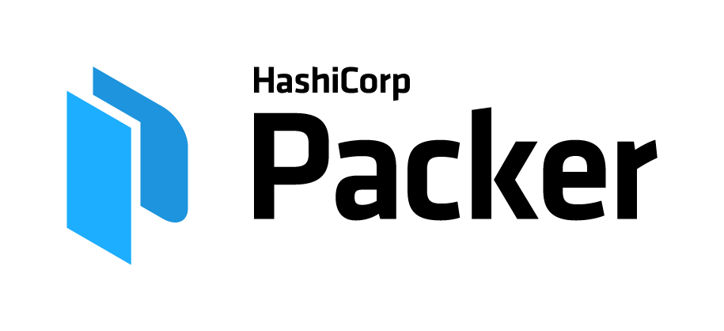

# node-app

This repository demonstrates the pipeline to deploy a simple web application.

Using Jenkins, an open source automation server, application code can be
committed to a git repository and then a deployed to AWS using Hashicorp's
Packer and Terraform.



### Start Jenkins

Linux:

```bash
docker run \
  --rm \
  --name docker-jenkins \
  -u root \
  -p 8080:8080 \
  -v jenkins-data:/var/jenkins_home \ 
  -v /var/run/docker.sock:/var/run/docker.sock \
  jenkinsci/blueocean
```


Windows:

```
docker run ^
  --rm ^
  --name docker-jenkins ^
  -u root ^
  -p 8080:8080 ^
  -v jenkins-data:/var/jenkins_home ^ 
  -v /var/run/docker.sock:/var/run/docker.sock ^
  jenkinsci/blueocean
```

### Get admin password

Linux

```bash
docker exec -it docker-jenkins \
  /bin/bash -c "cat /var/jenkins_home/secrets/initialAdminPassword"
```

Windows

```bash
docker exec -it docker-jenkins ^
  /bin/bash -c "cat /var/jenkins_home/secrets/initialAdminPassword"
```

### Create credential entries

AWS

**images

Github

**images

### Create pipeline from Github repo

**images

### Remove project

Get latest `terraform.tfstate` file

```git pull```

Destroy the deployment

```
terraform init config
terraform destroy -auto-approve config
```

(Don't forget to deregister the AMI)


### Create new branch
git branch {branchname}
git checkout {branchname}

Validate with git branch -a

git add .
git commit -m {message}
git push