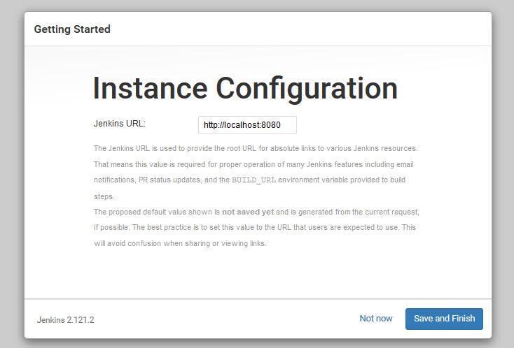
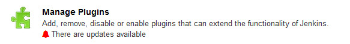
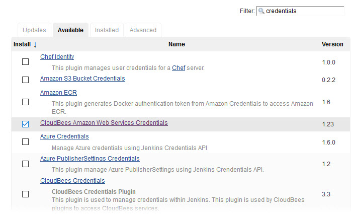
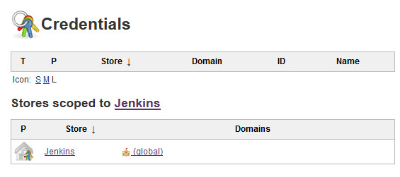
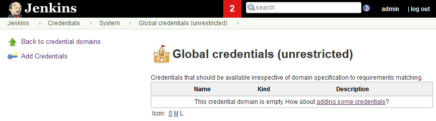
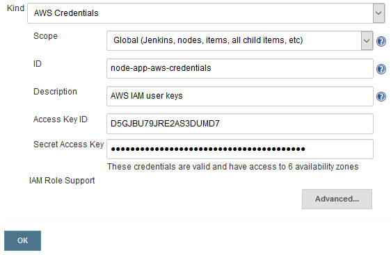

# Configure Jenkins

This guide uses the docker container for Jenkins' [Blue Ocean](https://jenkins.io/projects/blueocean/), specifically designed as a simplified GUI for the Jenkins Pipeline.

## Installation

[Jenkins](https://jenkins.io/) can be run as a remote server, or in this case, locally using [docker](https://www.docker.com/).

### Start the container

The following command runs the Jenkins server in the background with the name `docker-jenkins` for easy access. On the first run, a docker [volume](https://docs.docker.com/storage/volumes/) called `jenkins-data` is created and mounted as the Jenkins home directory.

##### Linux

```bash
docker run \
  -d \
  --name docker-jenkins \
  -u root \
  -p 8080:8080 \
  -v jenkins-data:/var/jenkins_home \
  -v /var/run/docker.sock:/var/run/docker.sock \
  jenkinsci/blueocean
```


##### Windows

```cmd
docker run ^
  -d ^
  --name docker-jenkins ^
  -u root ^
  -p 8080:8080 ^
  -v jenkins-data:/var/jenkins_home ^
  -v /var/run/docker.sock:/var/run/docker.sock ^
  jenkinsci/blueocean
```

After startup, the server's web portal can be accessed via [http://localhost:8080](http://localhost:8080).

Note: Since Jenkins will be running in docker, and docker will also be utilized within the Jenkins pipeline to run [Packer](https://www.packer.io/) and [Terraform](https://www.terraform.io/), it is also important to mount `docker.sock` from the host. That way, the docker controller in Jenkins uses the host's docker daemon to run its containers.

### Get the admin password


The admin password for Jenkins is created when the container is started with a new volume. If running Jenkins in the foreground, you'll get the following message toward the end of the output:

```bash
Please use the following password to proceed to installation:

(redacted)

This may also be found at: /var/jenkins_home/secrets/initialAdminPassword
```

If running Jenkins in the background, you can access the admin password with this command:

##### Linux

```bash
docker exec -it docker-jenkins \
  /bin/bash -c "cat /var/jenkins_home/secrets/initialAdminPassword"
```

##### Windows

```cmd
docker exec -it docker-jenkins ^
  /bin/bash -c "cat /var/jenkins_home/secrets/initialAdminPassword"
```

### Install default plugins

Selecting the default plugins is fine for now, only one other plugin is required, which will be installed later.


### Finish installation

Create a user account for Jenkins, or 'Continue as admin' (bottom right) with the admin password from earlier.


Since Jenkins is running in a container with port 8080 mapped, the URL [http://localhost:8080](http://localhost:8080) is fine.




### Install CloudBees AWS Credentials plugin

The only required plugin, CloudBees AWS Credentials will allow binding AWS credentials to steps in the pipeline so that Packer and Terraform can access AWS as an IAM user. In the Jenkins side menu, click 'Manage Jenkins', scroll down halfway, and click 'Manage Plugins'.



Select the available tab, and enable the [CloudBees Amazon Web Services Credentials](https://plugins.jenkins.io/aws-credentials) plugin. Then click 'Install without restart'.



### Add credentials to Jenkins

In the credentials section, you can click the down arrow next to the Jenkins Provider's (global) store.



Or click directly on the Jenkins Provider, and there is a option to 'Add Credentials' in the left menu. 



#### Github

To allow Jenkins (and the build-container agent) access to checkout this repository from Github, enter a Github username and personal access token for the password. Use 'node-app-git-credentials' as the ID, as it is referenced in the [Jenkinsfile](../Jenkinsfile).


#### AWS

Follow the same steps above, then select 'AWS Credentials' from the 'Kind' dropdown. Use 'node-app-aws-credentials' as the ID, as it is referenced in the [Jenkinsfile](../Jenkinsfile). Note: No modifications to 'Advanced...' settings or 'IAM Role Support' are required.



## Next Steps

- Create a [pipeline](pipeline.md)
