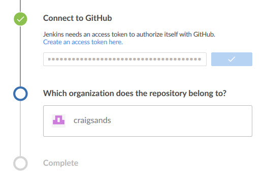
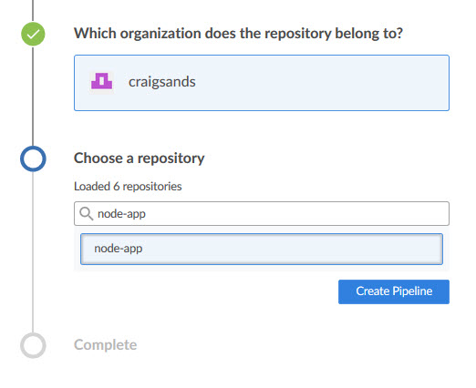

# Create a pipeline

A pipeline is the CI/CD component of Jenkins. The [Jenkinsfile](jenkinsfile.md) is the declarative representation of a pipeline, with the advantage that it can be checked into source control and tracked. See [https://jenkins.io/doc/book/pipeline/jenkinsfile/](https://jenkins.io/doc/book/pipeline/jenkinsfile/) for more information on creating a Jenkinsfile from scratch.

Jenkins' Blue Ocean makes creating pipelines (and their Jenkinsfile representations) simple. User's can create a pipeline from a straightforward UI, and then export that pipeline as a Jenkinsfile.

From the Jenkins home screen, click 'Blue Ocean' in the left menu or use the URL [http://localhost:8080/blue/organizations/jenkins](http://localhost:8080/blue/organizations/jenkins).

Click 'Create a new Pipeline' and select from a list of Git providers. For this repository, select 'Github'.

Jenkins needs access to the Github repository via an access token. Clicking on 'Create an access token here', will take you to the personal access token page in Github, and pre-select the specific permissions required for working with Jenkins. 

After importing a Github personal access token, select the appropriate organization and repository containing the application when prompted.

Jenkins then searches the repository for an existing Jenkinsfile. If none exist in the repository selected, Jenkins will start a new one. (In the below screenshot, a separate project, 'docker-jenkins', did not contain a Jenkinsfile.)

Otherwise, the pipeline will be built from the Jenkinsfile. (This repository, 'node-app' has one in the project root.)

Once the pipeline is created, Jenkins will start the pipeline.

You can then click on it to view the status step-by-step.

## Next Steps

- [Understand the Jenkinsfile](jenkinsfile.md)
